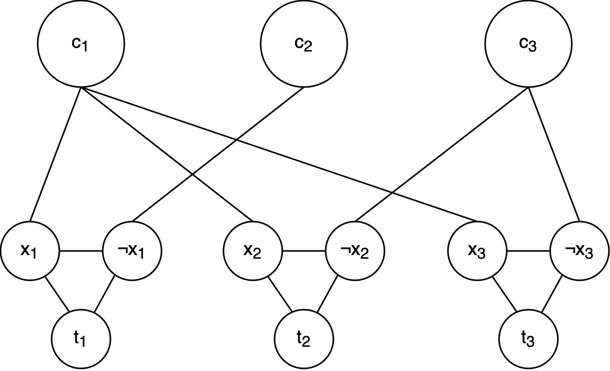

# 1

We show both sides of the implication:

$(\implies)$: Let $M$ be a decisive polytime NTM that decides the language $L$. Notice
first that when running $M$ on the input $x$, if $x \in L$ there must be a computation path that outputs __yes__; otherwise, $x \not\in L$, and it must be the case that there is a computation path that outputs __no__ (by decisiveness). Moreover, every computation path is guaranteed to halt, outputting __yes__, __no__, or __maybe__.

These observations are sufficient to construct two polytime verifiers $V$ and $V'$ that will show that $L \in \mathsf{NP}$ and $L \in \mathsf{coNP}$, respectively, by interpreting the certificate $C$ as the computation path, and running $M$ deterministically with that computation path. Specifically, on input $\langle x, C \rangle$, the verifier $V$:

* Runs $M$ on the input $x$ by interpreting $C$ as the computation path.
* Outputs __yes__ if $M$ returns __yes__, and outputs __false__ otherwise.

Similarly, on input $\langle x, C \rangle$, the verifier $V'$:

* Runs $M$ on the input $x$ by interpreting $C$ as the computation path.
* Outputs __yes__ if $M$ returns __no__, and outputs __false__ otherwise.

Since $M$ decides $L$, for $x \in L$, there exists a computation of $M$ that halts with output __yes__, thus showing that $V$ is a polytime verifier for $L$. Moreover, for $x \not\in L$, there exists a computation path of $M$ such that the output is __no__, and therefore $V'$ is also a polytime verifier for $\overline{L}$.

$(\impliedby)$: Let $L \in \mathsf{NP} \cap \mathsf{coNP}$, and let $V$ and $V'$ be polytime verifiers for $L$ and $\overline{L}$, respectively. We construct a decisive NTM $M$ that decides $L$ the following way:

* Non-deterministically choose each bit of the certificate $C$,
* Run the verifier $V(x, C)$ and output __yes__ if the verifier outputs __yes__.
* Run the verifier $V'(x, C)$ and output __no__ if the verifier outputs __yes__.
* Output __maybe__.

If $x \in L$, there exists a computation that will output __yes__ by the definition of $V$, and symmetrically if $x \not\in L$ there exists a computation that will output __no__. Thus $M$ decides $L$.

# 2

We can first build a verifier for the $\textsc{D3SAT}$ problem by using the same witness function as with $\textsc{SAT}$, which we know is polynomial. Thus, $\textsc{D3SAT}$ is in $\mathsf{NP}$.

To prove that the $\textsc{D3SAT}$ problem is $\mathsf{NP}$-hard, we reduce $\textsc{SAT} \leq_P \textsc{D3SAT}$. Given an instance of $\textsc{SAT}$, we construct an equisatisfiable instance of $\textsc{D3SAT}$ by transforming each clause to have three distinct variables, while preserving satisfiability. We separate the processing of these clauses into four different cases:

1. If the clause has three distinct variables, i.e., $C$ is equivalent to $(x_1 \lor x_2 \lor x_3)$, we leave it as is.
2. If the clause is a tautology, i.e., in $C$ there is a variable $x$ and its negation $\neg x$, we remove it as it will always be satisfied no matter the assignment.
3. If the clause has only two distinct variables due to a repetition of a literal, i.e., $C$ is equivalent to $(x_1 \lor x_1 \lor x_2)$, we can replace it with two clauses: $(x_1 \lor x_2 \lor x_3) \land (x_1 \lor x_2 \lor \neg x_3)$, where $x_3$ is a new variable.
4. If the clause has only one distinct variable, i.e., $C$ is equivalent to $(x_1 \lor x_1 \lor x_1)$, we can replace similarly to what we did in the previous case but with two more clauses and a new variable: $(x_1 \lor x_2 \lor x_3) \land (x_1 \lor x_2 \lor \neg x_3) \land (x_1 \lor \neg x_2 \lor x_3) \land (x_1 \lor \neg x_2 \lor \neg x_3)$, where $x_2$ and $x_3$ are new variables.

It is direct to see that the first and second cases are equivalent to the original $\textsc{SAT}$ instance. The third and fourth cases are equivalent to the original $\textsc{SAT}$ instance because the new variables $x_2$ and $x_3$ are not present in any other clause, and the new clauses are true if and only if the original clause is true. 

The transformation is linear in the size of the problem, the fourth case being the worst, where for 1 original clause we create 4. Thus, since the resulting instance of $\textsc{D3SAT}$ is satisfiable if and only if the original $\textsc{SAT}$ instance is satisfiable, $\textsc{D3SAT}$ is $\mathsf{NP}$-complete.

# 3

To prove that the $\textsc{Kernel}$ problem is in $\mathsf{NP}$, we build a verifier for $\textsc{Kernel}$. The certificate for the verifier is a possible solution represented by a set of vertices $S\subseteq V$ such that $|S| \leq k$. We need to check if this solution satisfies the two conditions:

* (Independence) The vertices in $S$ are not connected between each other.
* (Dominance) The set $S \cup N(S)$ contains all the vertices in the graph.

Checking for the independence condition is straightforward. We iterate over all pairs of vertices in $S$ and check if there is an edge between them. If we find an edge, it is not a valid certificate. Since there are $\binom{k}{2} = O(k^2)$ such pairs, this process has a time complexity of $O(|V|^2)$, which is polynomial in the size of the input.

Checking for the dominance condition is also polynomial. We first create the neighborhood set $N(S)$ by iterating over the connections of $S$, and then iterate over all vertices in the graph and check if they are in $S$ or in $N(S)$. This process has a time complexity of $O(k|V|+|V|)=O(|V|^2)$.

Thus, since we can verify the correctness of a solution in polynomial time, $\textsc{Kernel} \in \mathsf{NP}$.

To prove that it is $\mathsf{NP}$-hard, we reduce $\textsc{SAT} \leq_P \textsc{Kernel}$. Given an instance of $\textsc{SAT}$, we create a new graph $G$ with the following structure:

* For each variable $x_i$, we create three vertices: $x_i$, $\neg x_i$, and $t_i$. We add edges to connect them all with each other (such that this subgraph has a triangle structure).
* For each clause $C_j$, we create a vertex $c_j$ and connect it through edges with the vertices corresponding to the literals in the clause (either some $x_i$ or $\neg x_i$).

To put an example, we have the following graph for the $\textsc{SAT}$ instance $(x_1 \lor x_2 \lor x_3) \land (\neg x_1) \land (\neg x_2 \lor \neg x_3)$:

{width=256px}

Now, we prove that the $\textsc{SAT}$ instance is satisfiable if and only if the graph has a kernel of size $\leq m$, where $m$ is the number of variables in the $\textsc{SAT}$ instance.

$(\implies):$ If the $\textsc{SAT}$ instance is satisfiable, we can construct a kernel of size $m$ by selecting the vertices corresponding to the true literals in a valid assignment: for every $i$, we pick vertex $x_i$ if the variable $x_i$ is true, and $\neg x_i$ otherwise.

Since we are only selecting one value per variable for any $i$, both vertices $x_i$ and $\neg x_i$ will never be connected. Thus, since we do not pick any other vertex and different variables are not directly connected, the set is independent.

Since the assignment satisfies all clauses, any clause vertex will be connected to at least one vertex in the kernel set. Moreover, since the assignment chooses a value for each variable $x_i$, every triangle in the graph will have at least one vertex in the kernel set. Thus, the chosen subset would also be dominating.

$(\impliedby):$ For this direction, we will start with some observations and use them to construct a valid assignment for the $\textsc{SAT}$ instance given a kernel of size $\leq m$.

**Observation 1**: For every variable triangle, we need to pick one of the nodes $x_i$, $\neg x_i$, or $t_i$ for the kernel set to be dominating, since $t_i$ is only directly connected to $x_i$ and $\neg x_i$.

**Corollary 1**: For a set $S$ to be dominating (kernel), it must have a size of at least $m$, being the number of variables in the $\textsc{SAT}$ instance, or equivalently, the number of variables $t_i$.

From this observation and its corollary, we can conclude that the problem of finding a kernel of size $\leq m$ in this type of graph is equivalent to finding a kernel of size exactly $m$. Knowing that there needs to be $m$ nodes connecting to the $t_i$ vertices, we can do the following observation:

**Observation 2**: When looking for a kernel of size $m$, no clause vertex can be in the kernel set, as they are not connected to any $t_i$.

Thus, we can conclude that every kernel of size $m$ will only have exactly one vertex per variable triangle. Now, we just need to take care of the case that one of the picked variables is $t_i$ instead of $x_i$ or $\neg x_i$. We can do this by the following observation:

**Observation 3**: If a variable vertex $t_i$ is in a kernel set $S$, the set created by substituting in $S$ the vertex $t_i$ with either $x_i$ or $\neg x_i$ is also a kernel.

**Proof**: Since the original kernel set $S$ is dominating ($S \cup N(S) = V$), the set $S' = S \setminus \{t_i\} \cup \{x_i\}$ is also dominating because of $S \cup N(S) \subseteq S' \cup N(S') \subseteq V$, since $\{t_i\} \cup N(t_i) \subseteq \{x_i\} \cup N(x_i)$. The same argument can be made for the case where $t_i$ is substituted with $\neg x_i$. Since the set $S'$ is also independent (we still have one vertex per variable triangle), we can conclude that $S'$ is a valid kernel set.

From these observations, we can construct a valid assignment for the $\textsc{SAT}$ instance given a kernel of size $m$ (from Observation 2, it generalizes to $\leq m$). For every picked vertex in the kernel set (one vertex for each variable from Observation 1), we set the corresponding variable to true if the picked vertex is the vertex $x_i$, and false otherwise (even if it is $t_i$, from Observation 3 we can arbitrarily choose it to be false). From the dominance property, we know that every clause vertex is connected to at least one picked vertex, so one of its literals will be set to true, making the clause satisfied. Thus, the constructed assignment satisfies all clauses, and the $\textsc{SAT}$ instance is satisfiable.

Thus, we have shown that the $\textsc{SAT}$ instance is satisfiable if and only if the graph has a kernel of size $\leq m$, where $m$ is the number of variables in the $\textsc{SAT}$ instance. Since $\textsc{SAT}$ is $\mathsf{NP}$-complete, this shows that $\textsc{Kernel}$ is $\mathsf{NP}$-complete.
